## 頁面 1
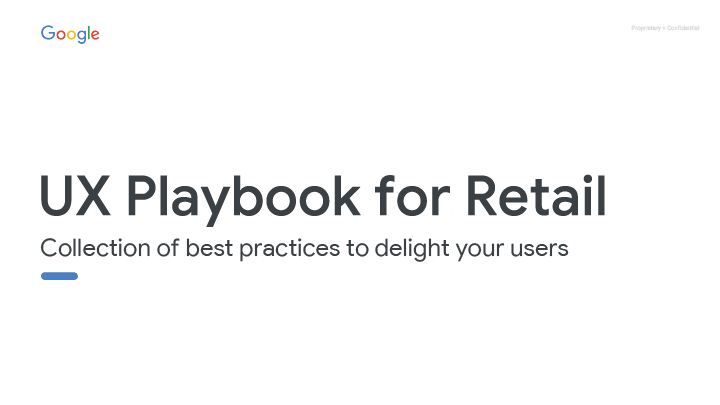

### UX Playbook for Retail

參考最佳實踐來討好你的用戶

---

## 頁面 2
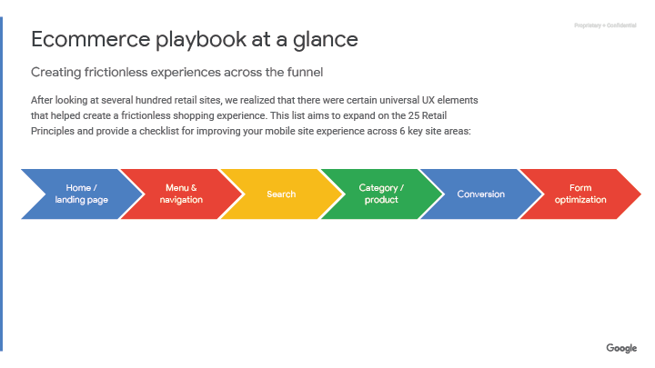

#### 電商UX建議指南懶人包

透過這些流程建構一個流暢的購物體驗

在閱覽過數以百計的電商網站平台後，我們發現，在建構一個流暢的購物體驗中，有些 UX 元素是共通的。這份報告，是為了擴展零售商的 25 法則，並且提供你如何透過六個重要頁面的調整，來提昇手機網站的體驗。

---

## 頁面 3
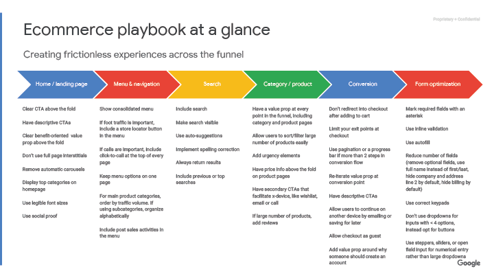

---

## 頁面 4
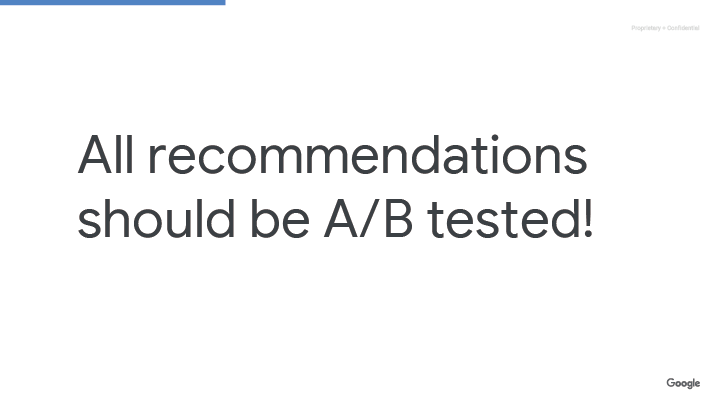

### 所有的建議都需要被 A/B Test（驗證）！

---

## 頁面 5
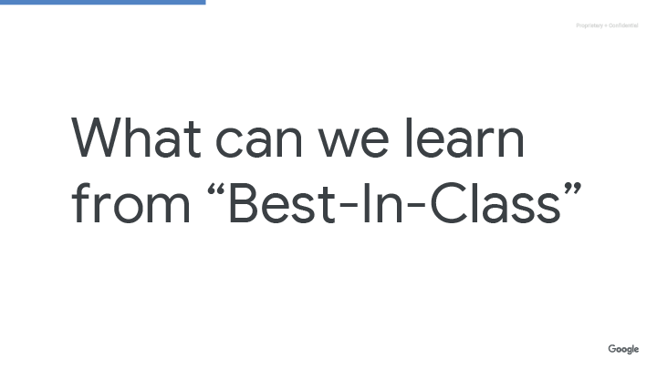

### 我們可以從最佳案例中學習到？
---

## 頁面 6
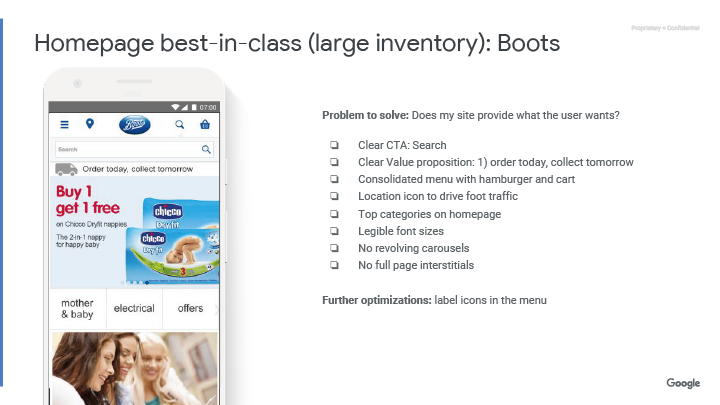

#### 首頁最佳案例（大量庫存）：Boots

**解決問題**：我的網站提供的是使用者想要的嗎？

- 清楚的行動呼籲：搜尋
- 清晰的價值主張：今天訂，明天取
- 整合的導覽列及購物車按鈕
- 顯示地點圖示標籤來吸引人潮
- 在首頁顯示熱銷主題
- 清晰可閱讀的字體大小
- 沒有輪播的圖片
- 沒有整頁式的插頁廣告

**進一步優化**：選單中的圖示標籤

---

## 頁面 7
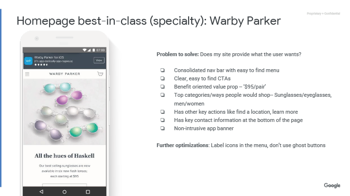

#### 首頁最佳案例（專業）: Warby Parker

**解決的問題**：我的網站提供什麼是用戶需要的

- 整合導覽列，讓選單容易被查找
- 清楚，並容易尋找到 CTAs（Call to Actions）
- 利益導向的價值主張：一副$95
- 提供其他行動呼籲：尋找門市地點、了解更多
- 在頁尾提供重要聯絡資訊
- 沒有擾人的 app 廣告

**進一步優化**：選單中的圖標，不要使用幽靈按鈕

---

## 頁面 8
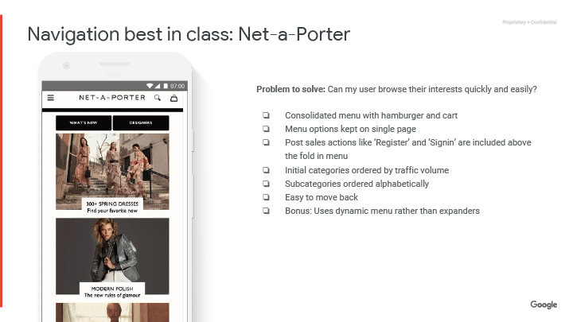

#### 導覽列最佳案例：Net-a-Porter

**解決問題**：我能讓使用者更快速、簡易地搜尋他們的喜好嗎？

- 整合導覽列及購物車
- 選單的選項保持在一頁
- 在導覽列上發布諸如註冊、登入等活動訊息
- 依流量排序分類順序
- 子層分類則用字母排序
- 容易回到上一頁
- 額外補充：使用動態的導覽列而不是單純擴展

---

## 頁面 9
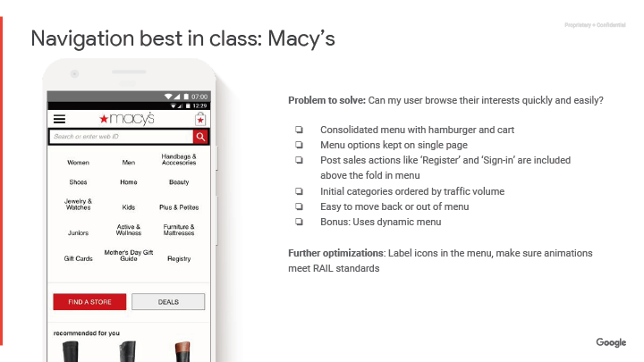

#### 導覽列最佳案例：Macy's

**解決問題**：我能讓使用者更快速、簡易地搜尋他們的喜好嗎？

- 整合導覽列及購物車
- 選單的選項保持在一頁
- 在導覽列上發布諸如註冊、登入等活動訊息
- 依流量排序分類順序
- 容易回到上一頁或離開選單
- 額外補充：使用動態的導覽列

**進一步優化**：在選單中使用圖示標籤，並確保其動畫符合 RAIL 規範

---

## 頁面 10
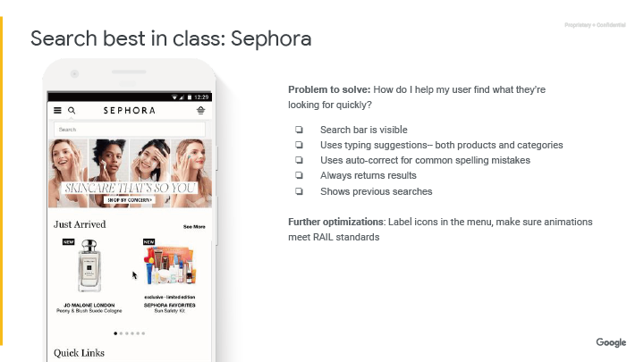

#### 搜索最佳案例：Sephora

**解決問題**：我該如何幫助使用者更快速地找到他們要的東西？

- 顯而易見的搜索列
- 使用輸入建議：包含產品與分類
- 自動校正常見拼音錯誤
- 不論任何情況都顯示搜尋結果 Always
- 顯示前次搜尋紀錄

**進一步優化**：在選單中使用圖示標籤，並確保其動畫符合 RAIL 規範

---

## 頁面 11
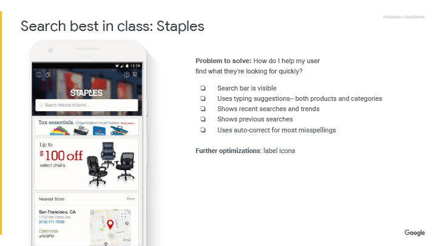

#### 搜索最佳案例：Staples

解決問題：我該如何幫助使用者更快速地找到他們要的東西？

- 顯而易見的搜索列
- 使用輸入建議：包含產品與分類
- 顯示近期熱搜及趨勢
- 顯示前次搜尋紀錄
- 自動校正常見拼音錯誤

**進一步優化**：在選單中使用圖示標籤

---

## 頁面 12
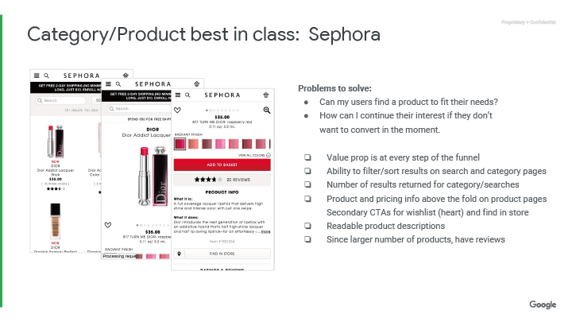

#### 分類 / 產品最佳案例：Sephora

**解決問題**：我能讓使用者找到符合他們需求的產品嗎？

- 如果使用者當下沒有購買，我該如何讓他們持續關注？
- 在各個流程顯示價值主張呼籲
- 在搜索列及分類頁中能夠分類及篩選
- 大量的搜尋結果
- 顯而易見的產品及價格資訊
- 提供次要的行動呼籲：例如收藏、尋找門市
- 可閱讀的字體大小
- 在產品頁中包含產品使用回饋

---

## 頁面 13
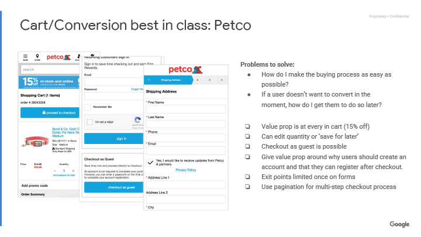

#### 購物車 / 轉換最佳案例：Petco

**解決問題**：我該如何讓購買流程越簡單越好？

- 如果使用者當下沒有購買，我該如何促使他下次購買？
- 在各個流程顯示價值主張的呼籲（折價15%）
- 讓使用者能夠編輯數量，或是列為下次購買
- 允許非會員結帳
- 在結帳後說明公司的服務價值，讓使用者願意註冊帳號
- 在購買流程中，讓離開流程的出口有限（例如只能點到首頁、回到購物車）
- 在繁雜的結帳流程中顯示進度條說明

---

## 頁面 14
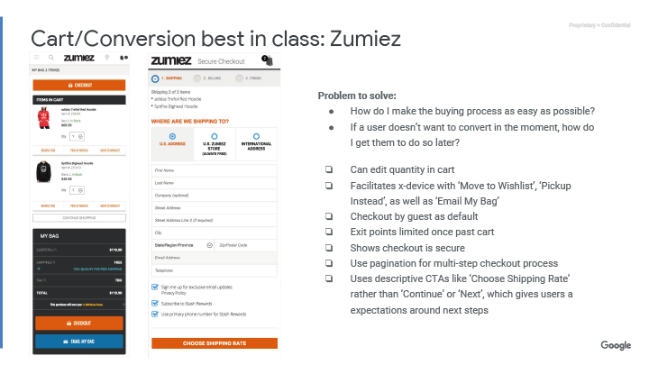

#### 購物車 / 轉換最佳案例：Zumiez

**解決問題**：我該如何讓購買流程越簡單越好？

- 如果使用者當下沒有購買，我該如何促使他下次購買？
- 可以在購物車編輯數量
- 透過：移至許願清單、下次再買、將購物清單寄送至電子信箱等等，讓跨裝置的使用變得更加容易
- 允許非會員結帳
- 在購買流程中，讓離開流程的出口有限（例如只能點到首頁、回到購物車）
- 讓使用者在結帳時感到安心
- 在繁雜的結帳流程中顯示進度條說明
- 使用描敘型的呼籲按鈕，例如「選擇運送方式」而非「下一步」，讓使用者對接下來的行為有所預期

---

## 頁面 15
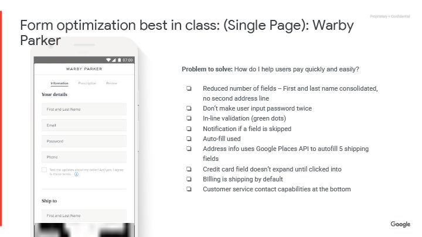

####  表格優化最佳案例（一頁式）：Warby Parker

**解決問題**：我該如何讓使用者快速並簡易的付款？

- 減少欄位數目：整合姓名欄、刪除第二住址欄位
- 不要讓使用者重複輸入密碼
- 輸入帳號密碼時的行內驗證（綠色圓形提示）
- 如果有欄位被跳過，顯示提醒通知
- 自動帶入已知資訊
- 使用 Google 位置偵測自動帶入住址資訊
- 直到點選信用卡欄位時，才展開信用卡資訊欄位
- 預設帳單寄送方式
- 在頁尾提供客服聯絡資訊

---

## 頁面 16
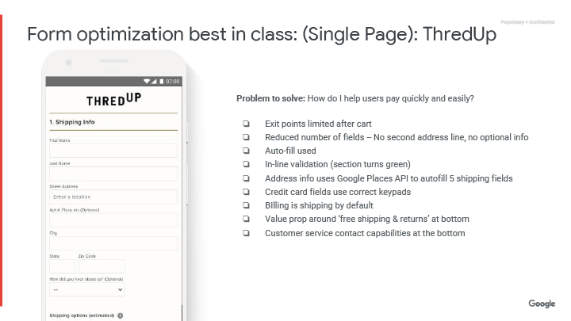

#### 表格優化最佳案例（一頁式）：ThredUp

**解決問題**：我該如何讓使用者快速並簡易的付款？

- 限制在購物車之後，才有離開流程的提示
- 減少欄位數目：刪除第二住址欄位、刪除額外資訊
- 自動填入已知資訊
- 輸入帳號密碼時的行內驗證（狀態轉變成綠色)
- 使用 Google 位置偵測自動帶入住址資訊
- 填入信用卡資訊時，帶入相對應的鍵盤
- 預設帳單寄送方式
- 在頁尾再次強調服務價值「免運費並且免費退貨」
- 在頁尾提供客服聯絡資訊
---

## 頁面 17
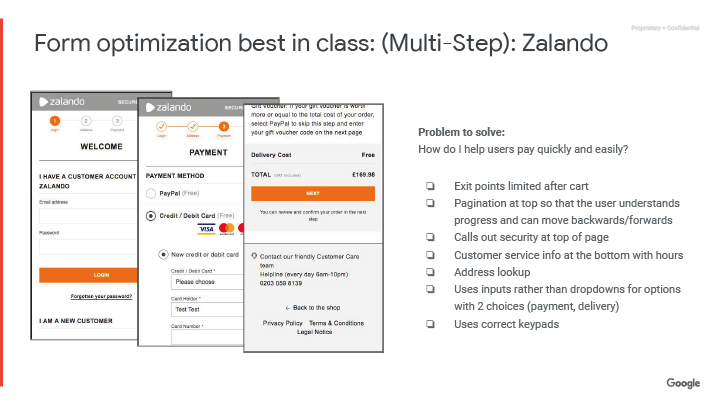

#### 表格優化最佳案例（多步驟流程）：Zalando

**解決問題**：我該如何讓使用者快速並簡易的付款？

- 限制在購物車之後，才有離開的提示
- 顯示進度條，讓使用者知道自己往前或往後的步驟。
- 在首頁強調安全性
- 在頁尾提供客服聯絡資訊及營業時間
- 提供查詢地址
- 當只有兩個選項時，使用輸入欄位而非下拉選單
- 填入資訊時，啟動相對應的鍵盤
---