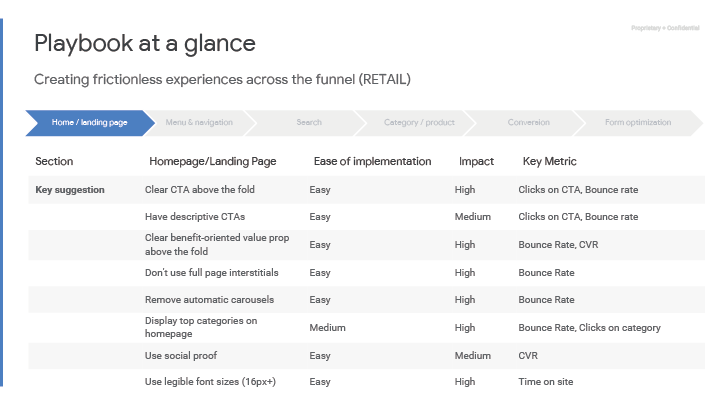
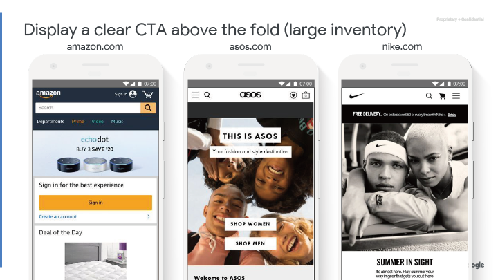
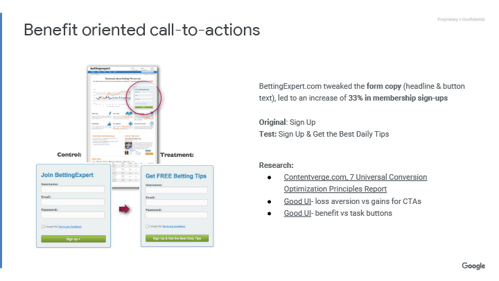
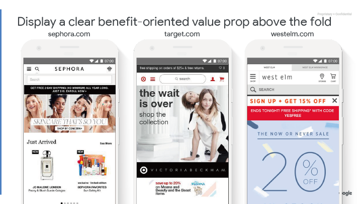
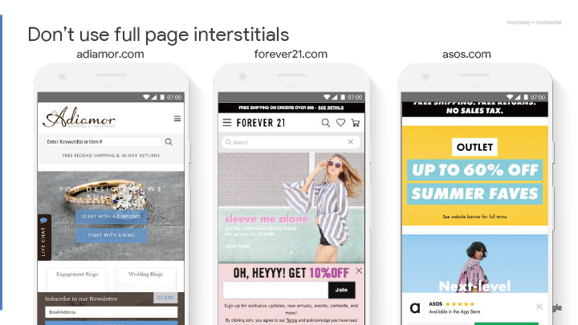
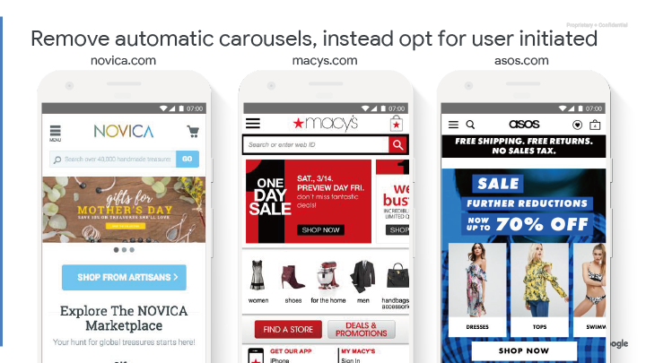
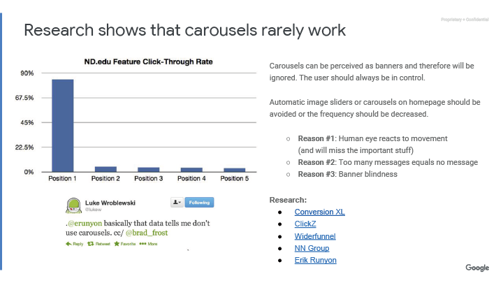
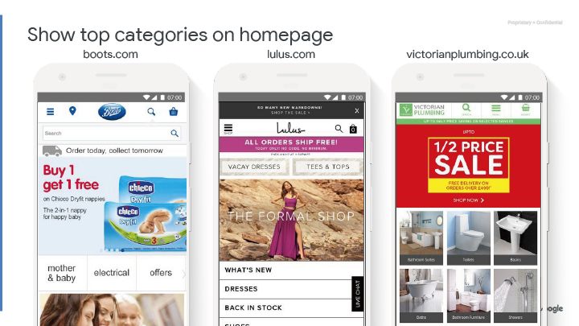
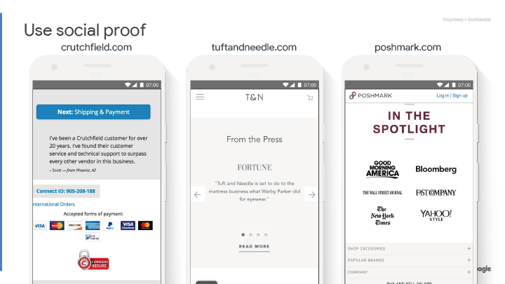

## 頁面 18

---

## 頁面 19

Playbook at a glance
> 待翻譯

Creating frictionless experiences across the funnel (RETAIL)
> 待翻譯

### 表格

<table>
  <tr>
    <th>Section</th>
    <th>Homepage/Landing Page</th>
    <th>Ease of implementation</th>
    <th>Impact</th>
    <th>Key Metric</th>
  </tr>
  <tr>
    <td>Key suggestion</td>
    <td>Clear CTA above the fold</td>
    <td>Easy</td>
    <td>High</td>
    <td>Clicks on CTA, Bounce rate</td>
  </tr>
  <tr>
    <td></td>
    <td>Have descriptive CTAs </td>
    <td>Easy</td>
    <td>Medium</td>
    <td>Clicks on CTA, Bounce rate</td>
  </tr>
  <tr>
    <td></td>
    <td>Clear benefit-oriented value prop
above the fold </td>
    <td>Easy</td>
    <td>High</td>
    <td>Bounce Rate, CVR</td>
  </tr>
  <tr>
    <td></td>
    <td>Don't use full page interstitials</td>
    <td>Easy</td>
    <td>High</td>
    <td>Bounce Rate</td>
  </tr>
  <tr>
    <td></td>
    <td>Remove automatic carousels</td>
    <td>Easy</td>
    <td>High</td>
    <td>Bounce Rate</td>
  </tr>
  <tr>
    <td></td>
    <td>Display top categories on
homepage </td>
    <td>Medium</td>
    <td>High</td>
    <td>Bounce Rate, Clicks on category</td>
  </tr>
  <tr>
    <td></td>
    <td>Use social proof </td>
    <td>Easy</td>
    <td>Medium</td>
    <td>CVR</td>
  </tr>
  <tr>
    <td></td>
    <td>Use legible font sizes (16px+)</td>
    <td>Easy</td>
    <td>High</td>
    <td>Time on site</td>
  </tr>
</table>

---

## 頁面 20

---

## 頁面 21

---

## 頁面 22

---

## 頁面 23

---

## 頁面 24

---

## 頁面 25

---

## 頁面 26

---

## 頁面 27

---

## 頁面 28

---

## 頁面 29

---

## 頁面 30

---