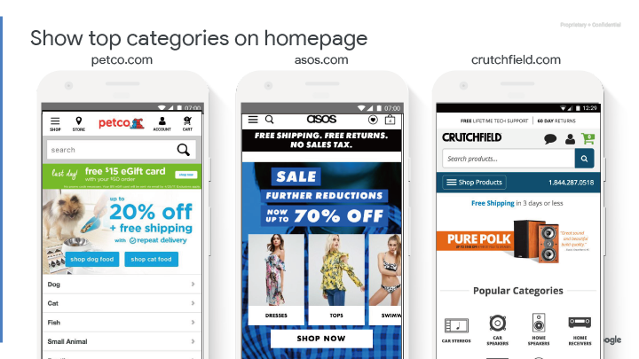

## 頁面 18

### 首頁 / 登入頁
---

## 頁面 19

教戰守則一覽表

透過漏斗創造直覺而流暢的體驗（零售）

### 表格

<table>
  <tr>
    <th>區塊</th>
    <th>首頁 / 登入頁</th>
    <th>實作的難易度</th>
    <th>影響程度</th>
    <th>關鍵指標</th>
  </tr>
  <tr>
    <td>重要建議</td>
    <td>明確的 CTA 在區塊上方</td>
    <td>簡單</td>
    <td>高</td>
    <td>CTA 的點擊、跳出率</td>
  </tr>
  <tr>
    <td></td>
    <td>具有描述性的 CTA </td>
    <td>簡單</td>
    <td>中等</td>
    <td>CTA 的點擊、跳出率</td>
  </tr>
  <tr>
    <td></td>
    <td>顯示明確的利益導向的內容於區塊上方。</td>
    <td>簡單</td>
    <td>高</td>
    <td>跳出率、廣告轉換率(CVR)</td>
  </tr>
  <tr>
    <td></td>
    <td>不要使用全頁的蓋版廣告</td>
    <td>簡單</td>
    <td>高</td>
    <td>跳出率</td>
  </tr>
  <tr>
    <td></td>
    <td>移除自動輪播</td>
    <td>簡單</td>
    <td>高</td>
    <td>跳出率</td>
  </tr>
  <tr>
    <td></td>
    <td>首頁顯示熱門商品</td>
    <td>中</td>
    <td>高</td>
    <td>跳出率、分類點擊率</td>
  </tr>
  <tr>
    <td></td>
    <td>加上社群佐證</td>
    <td>簡單</td>
    <td>中</td>
    <td>廣告轉換率(CVR)</td>
  </tr>
  <tr>
    <td></td>
    <td>使用清晰的文字大小(16px+)</td>
    <td>簡單</td>
    <td>高</td>
    <td>網站停留時間</td>
  </tr>
</table>

---

## 頁面 20

在首頁上標示明確的 Call to Action（特色零售）

---

## 頁面 21

在區塊上方顯示清晰的 Call to Action（大庫存）

---

## 頁面 22

具有描述性的 CTA（而不是 "下一個"、"購物"、"繼續"）

---
## 頁面 23

### 利益導向的 Call to Action

調整了表單副本（標題、按鈕內文）使會員註冊率提高了33％。

原始：Sign Up
測試：Sign Up & Get the Best Daily Tips

#### 研究:
- [Contentverge.com, 7 個通用轉換優化原則](http://contentverve.com/case-study-31-03-increase-in-sales-by-tweaking-the-call-to-action-copy-on-a-payment-page/)
- [Good UI](https://goodui.org/#30)- CTAs 的損失與收益
- [Good UI](https://goodui.org/#18)- 任務按鈕及收益

---

## 頁面 24

顯示明確的利益導向的內容於區塊上方。
---

## 頁面 25

不要使用整頁式的蓋版廣告。
---

## 頁面 26

移除輪播，改由用戶操作
---

## 頁面 27

### 研究顯示，輪播很少具有作用

輪播可以被視為一個橫幅內容，因此它會被忽略。而用戶應具有控制權。首頁上的自動輪播圖片使用頻率應減少。

- 理由一：人眼對於動態的反應（將會忽略掉重要的訊息）
- 理由二：太多訊息等同於沒有訊息
- 理由三：橫幅內容的慣性忽略

#### 研究：
- [Conversion XL](http://conversionxl.com/dont-use-automatic-image-sliders-or-carousels-ignore-the-fad/)
- [ClickZ](http://www.clickz.com/clickz/column/2164452/rotating-banners)
- [Widerfunnel](http://www.widerfunnel.com/conversion-rate-optimization/rotating-offers-the-scourge-of-home-page-design)
- [NN Group](https://www.nngroup.com/articles/auto-forwarding/)
- [Erik Runyon](https://erikrunyon.com/2013/01/carousel-stats)
---

## 頁面 28

首頁上顯示最熱門的類別
---

## 頁面 29

首頁上顯示最熱門的類別
---

## 頁面 30

加上社群佐證
---