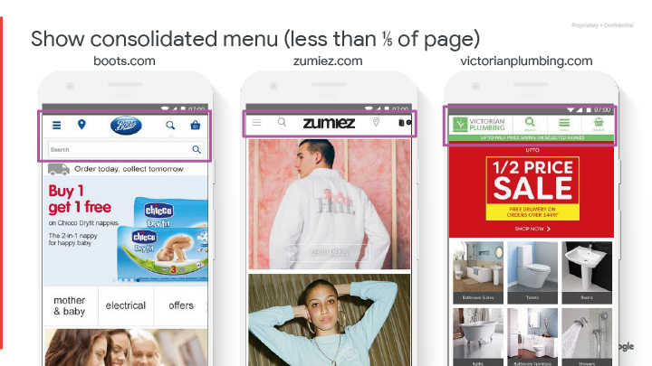
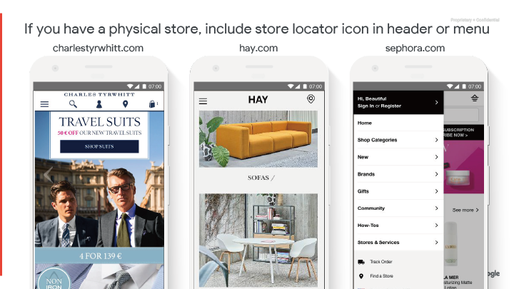
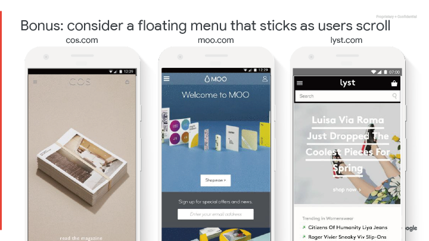

## 頁面 31

### 選單及導覽

---

## 頁面 32

### 教戰守則一覽表
透過漏斗創造直覺而流暢的體驗（零售）
<table>
  <tr>
    <th>項目</th>
    <th>選單&導覽</th>
    <th>實作的難易度</th>
    <th>影響程度</th>
    <th>關鍵指標</th>
  </tr>
  <tr>
    <td><strong>重要建議<strong></td>
    <td>顯示合併的選單</td>
    <td>中等</td>
    <td>高</td>
    <td>瀏覽頁次/訪次的增加</td>
  </tr>
  <tr>
    <td></td>
    <td>如果電話很重要，在每一頁的頂端加入"click-to-call"</td>
    <td>容易</td>
    <td>高</td>
    <td>圖示的點擊數</td>
  </tr>
  <tr>
    <td></td>
    <td>如果實體店面人潮很重要，在選單加入店面定位按鈕</td>
    <td>容易</td>
    <td>高</td>
    <td>圖示的點擊數</td>
  </tr>
  <tr>
    <td></td>
    <td>讓選單的選項保持在一頁以內</td>
    <td>中等</td>
    <td>中等</td>
    <td>每個訪次的瀏覽頁數</td>
  </tr>
  <tr>
    <td></td>
    <td>主要產品類別用流量排序</td>
    <td>容易</td>
    <td>中等</td>
    <td>每個訪次的瀏覽頁數</td>
  </tr>
  <tr>
    <td></td>
    <td>如果有使用子類別，則用字母排序</td>
    <td>容易</td>
    <td>中等</td>
    <td>每個訪次的瀏覽頁數</td>
  </tr>
  <tr>
    <td></td>
    <td>將售後活動加入選單內</td>
    <td>容易</td>
    <td>中等</td>
    <td>每個訪次的瀏覽頁數</td>
  </tr>
 
</table>

---

## 頁面 33

###  顯示合併的選單(小於頁面的1/5)

---

## 頁面 34

###  如果電話很重要，在選單加入電話圖示或電話號碼

---

## 頁面 35

###  如果你有實體店面，在表頭或選單加入商店定位圖示

---

## 頁面 36

### 補充：商店位置範例

---

## 頁面 37

### 讓選單在一個頁面的範圍之內，使用動態選單或是擴展選單

---

## 頁面 38

### 在選單加入如客戶服務等售後活動

---

## 頁面 39

### 實作可允許較佳視覺架構的動態選單

---

## 頁面 40

### 補充：動態選單範例

---

## 頁面 41

### 額外贈送：考慮當使用者捲動時，會固定在頂端的浮動選單

---

## 頁面 42

### 額外贈送：考慮放在底部的導覽列

---