## 頁面 43

### 搜尋

---

## 頁面 44
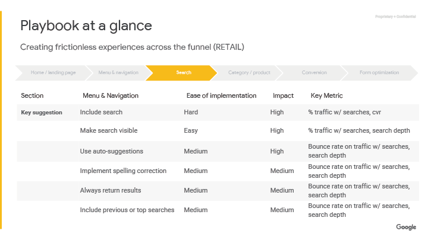
### 教戰守則一覽表
透過漏斗創造直覺而流暢的體驗（零售）

<table>
  <tr>
    <th>項目</th>
    <th>選單&導覽</th>
    <th>實作的難易度</th>
    <th>影響程度</th>
    <th>關鍵指標</th>
  </tr>
  <tr>
    <td><strong>重要建議<strong></td>
    <td>包含搜尋</td>
    <td>難</td>
    <td>高</td>
    <td>搜尋流量的百分比,cvr</td>
  </tr>
  <tr>
    <td></td>
    <td>使搜尋可被看見</td>
    <td>容易</td>
    <td>高</td>
    <td>搜尋流量百分比,搜尋深度</td>
  </tr>
    <tr>
    <td></td>
    <td>使用自動建議</td>
    <td>中等</td>
    <td>高</td>
    <td>搜尋流量的跳出率,搜尋深度</td>
  </tr>
    <tr>
    <td></td>
    <td>實作拼字校正</td>
    <td>中等</td>
    <td>中等</td>
    <td>搜尋流量的跳出率,搜尋深度</td>
  </tr>
    <tr>
    <td></td>
    <td>總是回傳結果</td>
    <td>中等</td>
    <td>中等</td>
    <td>搜尋流量的跳出率,搜尋深度</td>
  </tr>
    <tr>
    <td></td>
    <td>包含先前的搜尋或熱門搜尋</td>
    <td>中等</td>
    <td>中等</td>
    <td>搜尋流量的跳出率,搜尋深度</td>
  </tr>
 
</table>

---

## 頁面 45
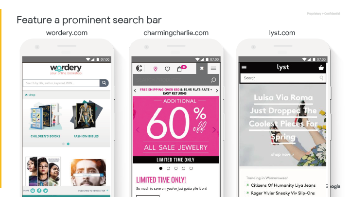

### 讓搜尋框很顯眼
---

## 頁面 46
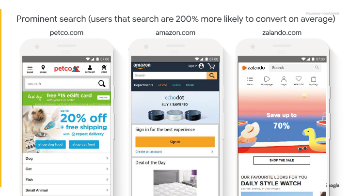

顯眼的搜尋(有使用搜尋功能的使用者平均多了200%的轉換)

---

## 頁面 47
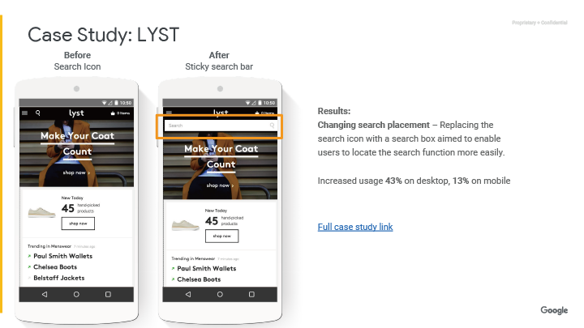

### 案例研究：LYST

- **之前** ：使用搜尋圖示
- **之後** ：使用停留在上方的搜尋框

**最終結果：**

**改變搜尋的位置** -
用搜尋框取代搜尋圖示，讓使用者更容易發現搜尋功能

在桌機增加 **43%** 的使用率，手機增加 **13%**

[完整案例研究連結](https://www.thinkwithgoogle.com/intl/en-cee/success-stories/local-case-studies/lyst-increases-overall-conversion-rate-25-making-usability-improvements/)

---

## 頁面 48
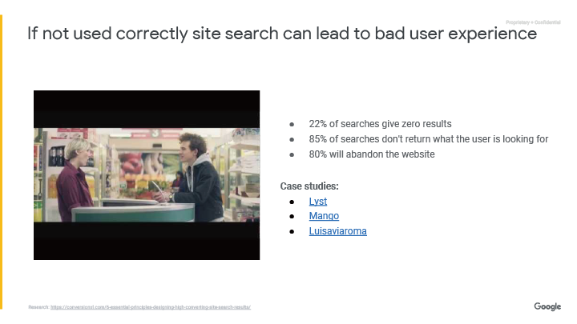

### 如果沒有正確使用全站搜尋，可能導致不好的使用者體驗

- 22%的搜尋會找不到東西
- 85%的搜尋沒有回傳使用者想要找的結果
- 80%將會離開網站

**案例研究:**
- [Lyst](https://www.thinkwithgoogle.com/intl/en-cee/success-stories/local-case-studies/lyst-increases-overall-conversion-rate-25-making-usability-improvements/)
- [Mango](https://www.thinkwithgoogle.com/intl/en-cee/success-stories/global-case-studies/mango-uses-google-analytics-360-and-optimise-360-testing-mobile/)
- [Luisaviaroma](https://www.thinkwithgoogle.com/intl/it-it/canali-pubblicitari/mobile/luisaviaroma-case-study/)

---

## 頁面 49
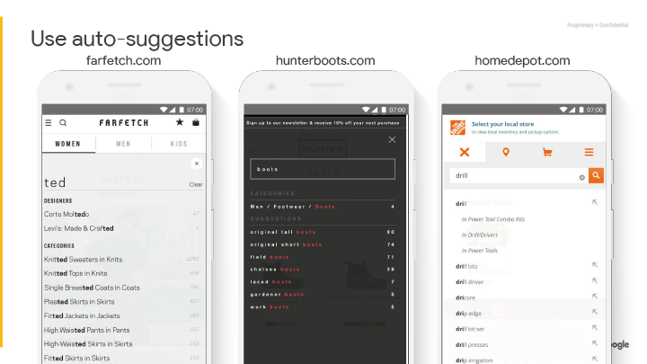

### 使用自動建議

---

## 頁面 50
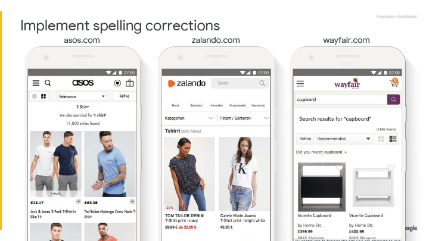

### 實作拼字校正

---

## 頁面 51
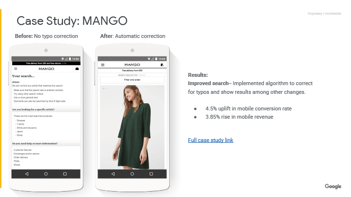

### 案例研究:MANGO

**之前:** 沒有拼字錯誤校正

**之後：** 自動校正

**最終結果：**

**改善搜尋** - 實作演算法去校正拼字錯誤並顯示修正後的搜尋結果

- 手機轉換率提升4.5%
- 手機收益提升3.85%

[完整案例研究連結](https://www.thinkwithgoogle.com/intl/en-cee/success-stories/global-case-studies/mango-uses-google-analytics-360-and-optimise-360-testing-mobile/)

---

## 頁面 52
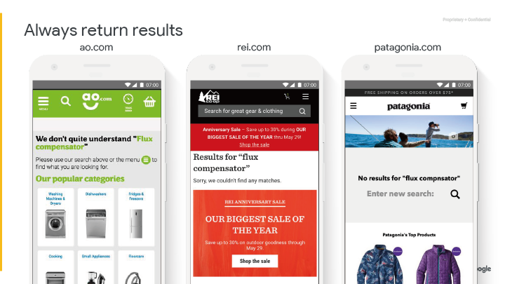

### 總是回傳搜尋結果

---

## 頁面 53
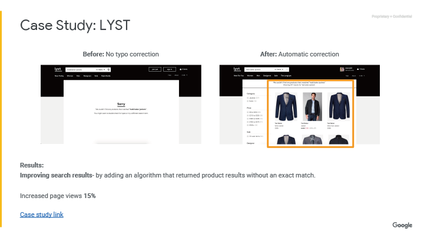

### Case Study：LYST

**之前:** 沒有拼字錯誤校正

**之後：** 自動校正

**最終結果：**

**改善搜尋結果** -  增加回傳非精確搜尋產品結果的演算法

- 增加頁面瀏覽數 15%

[案例研究連結](https://docs.google.com/presentation/d/17gowFcsjZplxasgOs6NJztM5Ny-7nGrvfAXAG15hLLk/edit#slide=id.g101c97cb7e_0_17)

---

## 頁面 54
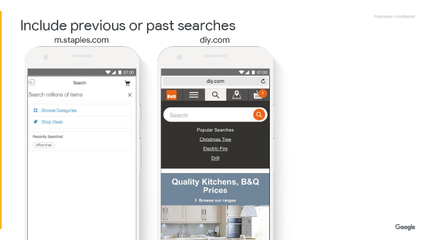

### 提供最近搜尋過的文字或別人搜尋過的文字

---