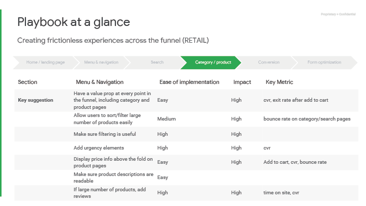
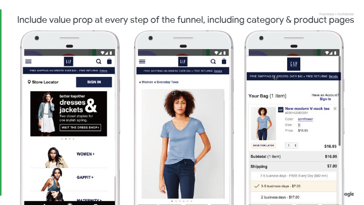
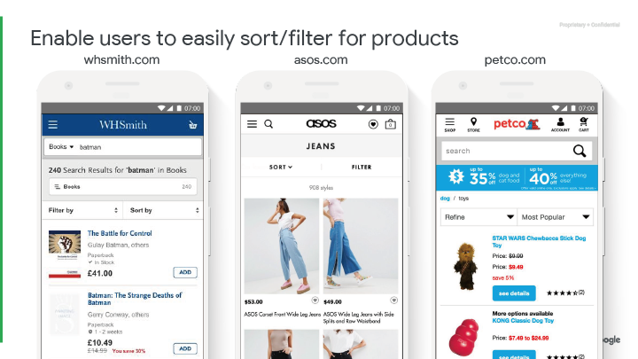
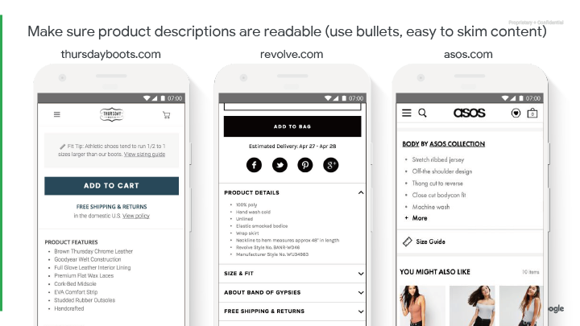
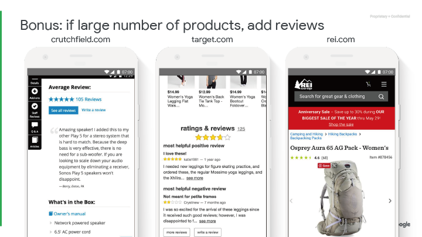

## 頁面 55

### 分類/產品

---

## 頁面 56

### 教戰守則一覽表
透過漏斗創造直覺而流暢的體驗（零售）

<table>
  <tr>
    <th>項目</th>
    <th>選單&導覽</th>
    <th>實作的難易度</th>
    <th>影響程度</th>
    <th>關鍵指標</th>
  </tr>
  <tr>
    <td><strong>重要建議<strong></td>
    <td>漏斗中每個階段都有其價值，包含分類頁面及產品頁面</td>
    <td>容易</td>
    <td>高</td>
    <td>cvr 、加入購物車後的離開率 (Exit Rate)</td>
  </tr>
  <tr>
    <td></td>
    <td>讓使用者能夠容易的對大量商品進行分類及排序</td>
    <td>中等</td>
    <td>高</td>
    <td>分類頁面或搜尋頁面的跳出率 (Bounce Rate)</td>
  </tr>
    <tr>
    <td></td>
    <td>確保分類、過濾是有用的</td>
    <td>難</td>
    <td>高</td>
    <td></td>
  </tr>
    <tr>
    <td></td>
    <td>推出具急迫性的商品</td>
    <td>難</td>
    <td>高</td>
    <td>cvr</td>
  </tr>
    <tr>
    <td></td>
    <td>每個產品頁面都需有價格資訊</td>
    <td>容易</td>
    <td>高</td>
    <td>加入購物車、 cvr 、跳出率 (Bounce Rate)</td>
  </tr>
    <tr>
    <td></td>
    <td>確保產品資訊是正確的</td>
    <td>容易</td>
    <td></td>
    <td></td>
  </tr>
  </tr>
    <tr>
    <td></td>
    <td>如果有大量的商品，增加評價機制</td>
    <td>難</td>
    <td>高</td>
    <td>網站停留時間、 cvr</td>
  </tr>
 
</table>
---

## 頁面 57

### 漏斗中每個階段都有其價值，包含分類頁面及產品頁面
---

## 頁面 58

### 讓使用者能夠容易的對大量商品進行分類及排序
---

## 頁面 59

### 確保分類、過濾是有用的
---

## 頁面 60

### 每個產品頁面都需有價格資訊
---

## 頁面 61

### 推出限時或限量的商品
---

## 頁面 62

## 研究
如果操作得當，急迫性將提供強大的購買動機。

三個方式創造急迫性：

  - **數量限制** (這個價格只剩三張票券)
  - **時間限制** (折價票券只販售到七月一號)
  - **情境限制** (父親節即將來臨，快挑個禮物)

---

## 頁面 63

### 案例研究：LYST
- **之後** ：增加商品銷售很好的情境

**凸顯急迫感** - 
 藉由在商品頁面顯示「物品銷售的非常快」

**結果:** CVR 提升了 **17%**

---

## 頁面 64

### 確保產品資訊是正確的 (使用清單，易於修改內容)
---

## 頁面 65

### 於轉換點重新強調商品優勢
---

## 頁面 66

### **加分:** 如果有大量的商品，增加評價機制
---

## 頁面 67

### **加分:** 為額外的轉換行為增加次要的 CTAs 
---

## 頁面 68

### **加分:** 使瀏覽器元素與品牌搭配 ([info how](https://developers.google.com/web/fundamentals/design-and-ux/browser-customization/),[research](https://www.colorcom.com/research/why-color-matters))
---