## 頁面 69

### 轉換 (Conversion)

---

## 頁面 70
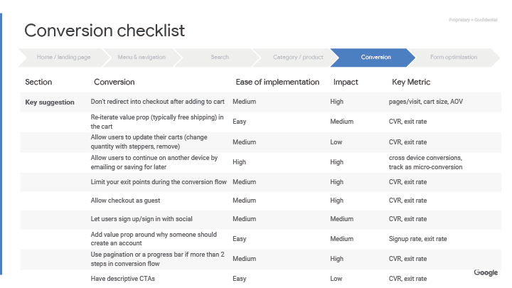
#### 轉換確認列表

<table>
  <tr>
    <th>項目</th>
    <th>轉換</th>
    <th>實行難度</th>
    <th>影響強度</th>
    <th>關鍵指標</th>
  </tr>
  <tr>
    <td>重點建議</td>
    <td>加入到購物車後，不要重新導向到結帳頁面</td>
    <td>中</td>
    <td>高</td>
    <td>頁面 / 訪問、購物車大小、AOV</td>
  </tr>
  <tr>
    <td></td>
    <td>在購物車中反覆重申價值主張 (通常是免運)</td>
    <td>低</td>
    <td>中</td>
    <td>CVR、離開率</td>
  </tr>
  <tr>
    <td></td>
    <td>允許用戶更新他們的購物車(使用步驟進度條更改、刪除數量)</td>
    <td>中</td>
    <td>低</td>
    <td>CVR、離開率</td>
  </tr>
  <tr>
    <td></td>
    <td>允許用戶透過 email 或保存功能，以便之後能在其他裝置上繼續使用</td>
    <td>高</td>
    <td>高</td>
    <td>跨裝置轉換、微觀轉換</td>
  </tr>
  <tr>
    <td></td>
    <td>在轉換流程中限制離開點</td>
    <td>中</td>
    <td>高</td>
    <td>CVR、離開率</td>
  </tr>
  <tr>
    <td></td>
    <td>允許訪客結帳</td>
    <td>中</td>
    <td>高</td>
    <td>CVR、離開率</td>
  </tr>
    <tr>
    <td></td>
    <td>讓使用者可以用社群帳號註冊 / 登入</td>
    <td>中</td>
    <td>中</td>
    <td>CVR、離開率</td>
  </tr>
    <tr>
    <td></td>
    <td>增加創建帳戶的價值</td>
    <td>低</td>
    <td>中</td>
    <td>註冊率、離開率</td>
  </tr>
  <tr>
    <td></td>
    <td>如果轉換流程超過 2 個步驟，請使用分頁或是進度條</td>
    <td>中</td>
    <td>高</td>
    <td>CVR、離開率</td>
  </tr>
    <tr>
    <td></td>
    <td>有描述性的 CTAs</td>
    <td>低</td>
    <td>低</td>
    <td>CVR、離開率</td>
  </tr>
</table>

- AOV: 監控平均訂單價值
- CVR: 廣告轉換率 (轉換次數 / 廣告點擊次數)
- CTA: call to action，引導使用者前往下一步的重要設計
- 訪客結帳：消費者不用登入帳戶就能直接購買商品

---

## 頁面 71
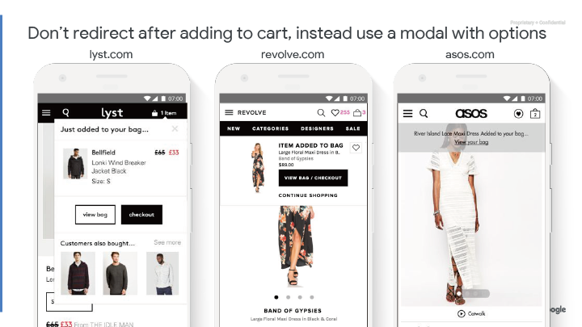

#### 加到購物車時不要重新導向，除非使用含有選項的互動視窗

---

## 頁面 72

#### 案例研究 - LYST

**Before**
使用者被重新導向到購物車

**After**
加入到購物車通知

**Lyst: 更新了加到購物車的流程 -** 增加彈出式視窗通知使用者已加到購物車，而不是重新導向到購物車頁面
- 平均訂單價值成長 4%

補充訊息:
- 提供使用者選項：
  - 繼續購買 (離開或是繼續購物按鈕)
  - 觀看購物車內的商品
  - 直接結帳

---

## 頁面 73

#### 案例研究 - AllYouNeedFresh

他們做了什麼？

- 將出貨日期的選項移動至結帳流程的開頭
- 在結帳頁面底部的購物籃中加入 “繼續結帳” 來做行為引導
- 自動確認用戶的信用卡別，而不是讓用戶從下拉式選單中選擇
- 輸入內容長度與輸入框長度相互匹配
- 透過分段控制列（segmented controls）展露標題選項
- 表單欄位使用 `labels` 而非 `placeholders` 
- 放大 “儲存” 來做行為引導並增加對比度讓它更顯而易見

結果

- 行動裝置交易成長 51%
- 行動裝置轉換率提升 14%
- 訂單確認頁面流失下降了 21％

[案例研究連結](https://www.thinkwithgoogle.com/intl/en-gb/success-stories/global-success-stories/improved-checkout-boosts-mobile-orders-51-allyouneedfresh/)

---

## 頁面 74
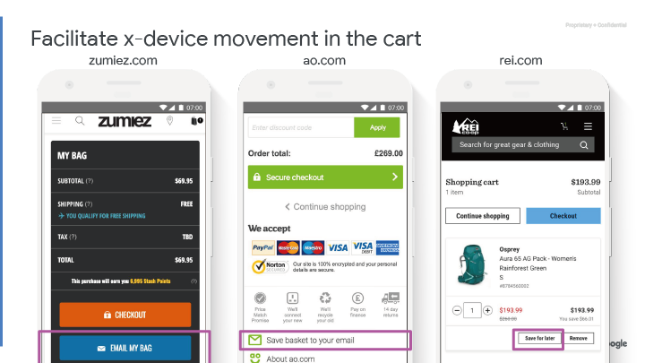

#### 便於購物車在 x-裝置上進行動作

---

## 頁面 75
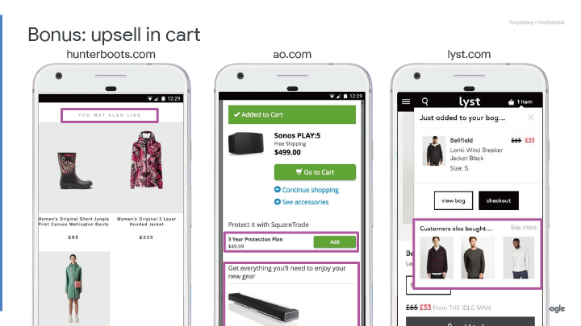

####  加分：購物頁面的推銷

---

## 頁面 76
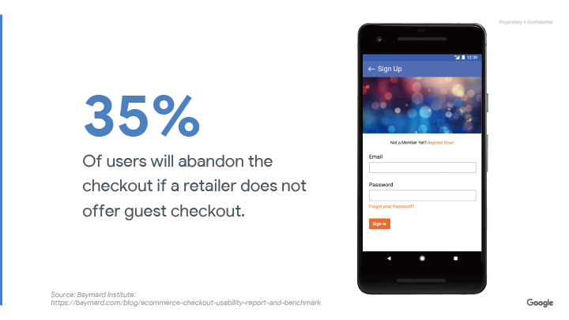

#### 如果零售商不提供訪客結帳，35% 的用戶會放棄結帳。

資料來源: Baymard Institute:

https://baymard.com/blog/ecommerce-checkout-usability-report-and-benchmark

---

## 頁面 77

####  允許訪客結帳

---

## 頁面 78

#### 增加創建帳戶的價值

---

## 頁面 79

#### 補充：不要讓使用者確認帳戶資訊

---

## 頁面 80
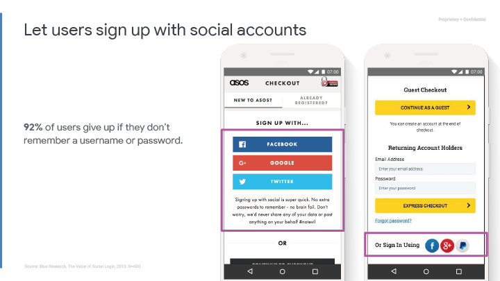

#### 讓使用者可以用社群帳號註冊

如果使用者不記得帳戶名稱或密碼，有 92％的使用者會放棄。

---

## 頁面 81

####  整合 Google 身份驗證一鍵註冊 (提升 2 到 4 倍以上的註冊率)

**一鍵註冊**

只需要輕輕一按即可註冊新帳戶，而無需透過註冊畫面中斷他們。使用者在您的網站上獲得基於授權的安全無密碼帳戶，並受其 Google 帳戶的保護。[更多資訊](https://developers.google.com/identity/one-tap/web/)。

**自動登入**

使用者在任何裝置或瀏覽器上返回到您的站點時會自動登錄，即使他們的 session 到期後也是如此。[更多資訊](https://developers.google.com/identity/one-tap/web/)。

---

## 頁面 82
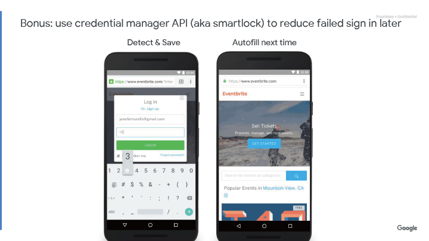

#### 加分：使用憑證管理器 API（也稱為智能鎖）來減少以後登入失敗

**檢測並保存**

**下一次自動填入**

---

## 頁面 83
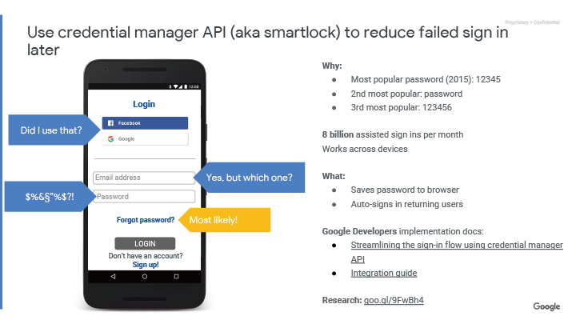

#### 使用憑證管理器 API（也稱為智能鎖）來減少以後登入失敗

**為什麼 (Why)：**
- 最受歡迎的密碼（2015）：12345
- 第二熱門密碼：password
- 第三熱門密碼：123456

每個月有 **80 億** 輔助登入系統在各種裝置上運行

**做什麼 (What)：**
- 將密碼保存到瀏覽器
- 使用者自動登入後跳轉

**Google Developers** 執行文件：
- [使用憑證管理器簡化登入流程 API](https://developers.google.com/web/updates/2016/04/credential-management-api)
- [整合指南](https://developers.google.com/web/fundamentals/security/credential-management/)

**研究：** https://www.teamsid.com/worst-passwords-2015/

---

## 頁面 84
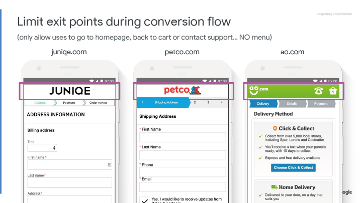

#### 在轉換流程中限制離開點

（僅允許使用者進入首頁，回到購物車或聯繫支援服務......沒有選單）

---

## 頁面 85
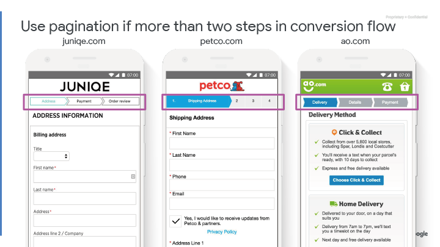

#### 如果轉換流程超過 2 個步驟，請使用分頁

---

## 頁面 86
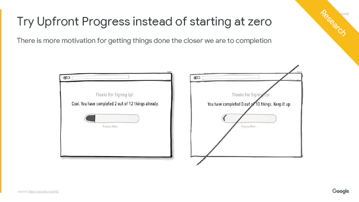

#### 嘗試使用預先開始的進度條來代替從零開始

越接近完成，我們就越有動力完成事情

---

## 頁面 87

#### 有描述性的 CTAs

---

## 頁面 88

#### 案例研究 - AllYouNeedFresh

他們做了什麼？

- 將出貨日期的選項移動至結帳流程的開頭
- 在結帳頁面底部的購物籃中加入 “繼續結帳” 來做行為引導
- 自動確認用戶的信用卡別，而不是讓用戶從下拉式選單中選擇
- 輸入內容長度與輸入框長度相互匹配
- 透過分段控制列（segmented controls）展露標題選項
- 表單欄位使用 `labels` 而非 `placeholders` 
- 放大 “儲存” 來做行為引導並增加對比度讓它更顯而易見

結果

- 行動裝置交易成長 51%
- 行動裝置轉換率提升 14%
- 訂單確認頁面流失下降了 21％

[案例研究連結](https://www.thinkwithgoogle.com/intl/en-gb/success-stories/global-success-stories/improved-checkout-boosts-mobile-orders-51-allyouneedfresh/)

---

## 頁面 89

#### 結帳前顯示摘要

顯示點選確認後下一步驟要做什麼

---