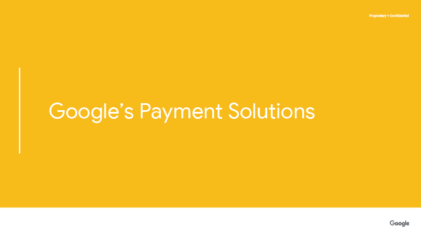
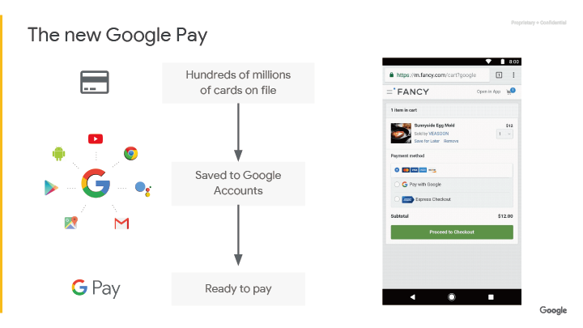
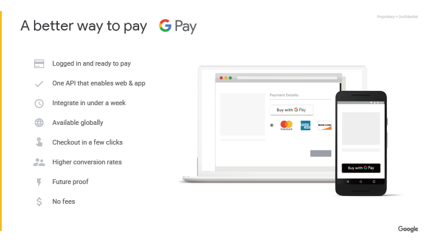
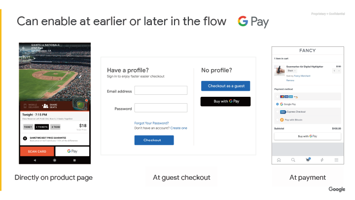
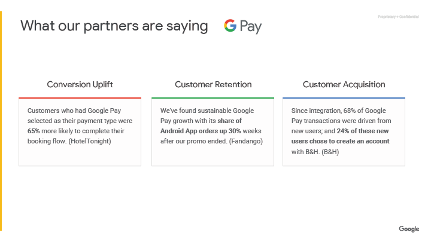
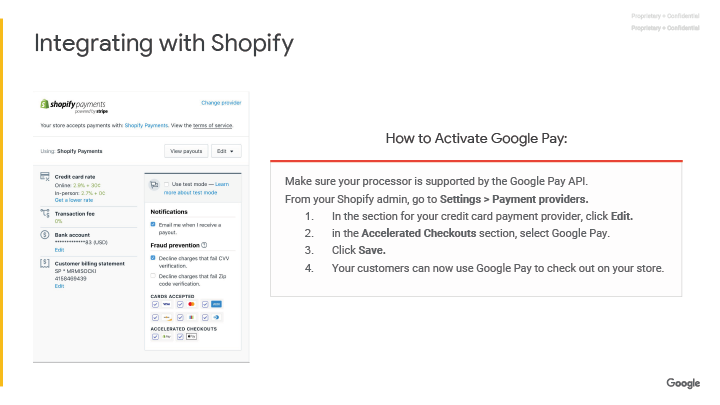

## 頁面 90

>Google's Payment Solutions
>google對行動支付提出最佳實踐方法

---

## 頁面 91

>The new Google Pay
>Google支付

>Hundreds of millions of cards on file
>許多的信用卡號在各種不同的檔案上

>Saved to Google Accounts
>儲存在Google帳號

>Ready to pay
>準備支付

---

## 頁面 92

>A better way to pay--GPay
>一個更好的支付方式--GPay
  
>  Logged in and ready to pay
>  登入支付
>  One API that enables web & app
>  一組支付界面對應一組網頁及app
>  Integrate in under a week
>  一周內整合所有支付方式
>  Available globally
>  一次整合，全球使用
>  Checkout in a few clicks
>  更少點擊，更快結帳
>  Higher conversion rates
>  更高的轉換率
>  Future proof
>  未來的支付趨勢
>  No fees
>  不需要額外費用

---

## 頁面 93

>Can enable at earlier or later in the flow GPay
>可以在購物流程中加入GPay

>Directly on product page
>在商品頁上使用
>At guest checkout
>在訪客購物頁面上使用
>At payment
>在確認購物方式頁上使用

---

## 頁面 94

>What our partners are saying GPay
>使用過GPay的公司評價

>Conversion Uplift
>訂單轉換率上升
>Custom who had Google Pay selected as their payment type were 65% more likely to complete their booking flow.(HotelTonight)
>消費者使用GPay付費後，完成整個預定流程的可能性提高65%(HotelTonight:https://www.hoteltonight.com/)
>Customer Retention
>更多活躍消費者
>We've found sustainable Google Pay grouth with its share of Android App orders up 30% weeks after our promo ended.(Fandango)
>我們發現我們促銷活動結束後，可以持續的Google Pay在Android App訂單占比成長30%(Fandango:https://www.fandango.com/)
>Customer Acquisition
>提高市場市占率
>Since integration, 68% of google pay transactions were driven from new users; and 24% of these new users chose to create an account with B&H.(B&H)
>整合GPay以後，有68%的GPay消費來自新的使用者，其中的24%使用者也成為B&H的新使用者。

---

## 頁面 95

>Integrating with Shopify
>Shopify的整合狀況
>How to Activate Google Pay:
>怎麼在Shopify上啟用GPay
>Make sure your processor is supported by the Google Pay API.
>確定您的Shopify商城串接GPay的資料交換界面
>From your Shopify admin, go to Setting > Payment providers.
>前往Shopify後台管理界面，設定 > 支付方式供應商
>  1.  in the section for your credit card payment provider, click Edit.
>  找到您的信用卡支付供應商的區塊，點擊編輯
>  2.  in the Accelerated Checkouts section, Google Pay.
>  在您的加速購物流程區塊裡面，選擇GPay
>  3.  Click Save.
>  點擊儲存
>  4.  Your customers can now use Google Pay to check out on your store.
>  現在您的消費者能在您的商城能使用GPay消費了

---
