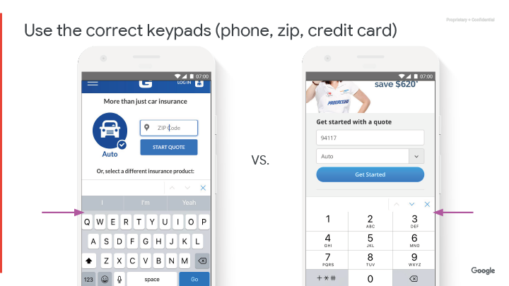

## 頁面 96

### 表單優化

---

## 頁面 97

#### 指南摘要
透過漏斗創造直覺而流暢的體驗（零售）

<table>
  <tr>
    <th>項目</th>
    <th>表單優化</th>
    <th></th>
    <th>實行難度</th>
    <th>影響強度</th>
    <th>關鍵指標</th>
  </tr>
    <td>建議要點</td>
    <td>使用行內驗證與自動填入</td>
    <td></td>
    <td>中</td>
    <td>中</td>
    <td>完成表格</td>
  </tr>
  <tr>
    <td></td>
    <td>減少表單欄位的數量</td>
    <td>
      <ul>
        <li>移除選填欄位</li>
        <li>使用全名取代姓與名</li>
        <li>隱藏公司與第二行地址</li>
        <li>預設收件地址等於帳單地址</li>
      </ul>
    </td>
    <td>中</td>
    <td>中</td>
    <td>完成表格</td>
  </tr>
  <tr>
    <td></td>
    <td>若少於四個選項，請使用按鈕選項而不是下拉式選單</td>
    <td></td>
    <td>低</td>
    <td>低</td>
    <td>完成表格</td>
  </tr>
  <tr>
    <td></td>
    <td>在輸入數字時使用 <i>steppers</i>、<i>sliders</i>、或 <i>open field input</i>，而不是大型的下拉式選單</td>
    <td></td>
    <td>低</td>
    <td>低</td>
    <td>完成表格</td>
  </tr>
  <tr>
    <td></td>
    <td>使用正確的鍵盤類別</td>
    <td></td>
    <td>低</td>
    <td>低</td>
    <td>完成表格</td>
  </tr>

</table>

---

## 頁面 98

## 用手機打字是件難事

---

## 頁面 99

#### 使用行內驗證與自動填入
- 行內驗證
- 行內驗證
- 自動填入

---

## 頁面 100

#### 減少表單欄位的數量
- 使用全名
- 使用 Google 自動完成地址的 API（[連結](https://developers.google.com/places/web-service/autocomplete)）
- 預設收件地址與帳單地址是一樣的

---

## 頁面 101

#### 減少結帳頁面的表單欄位
有 **27％** 的用戶會因為「太長或太複雜的結帳流程」而放棄訂單。

**表現最佳的電商網站會有 6-8 個欄位、總計 12 個表單元素。**
零售業的結帳流程平均有 14.88 個表單欄位。

**表單優化：**
1. 使用全名欄位，省去欄位標題
2. 預設收件地址 = 帳單地址
3. 將第二行地址與公司名稱的欄位折疊成連結

[完整研究](https://baymard.com/blog/checkout-flow-average-form-fields)

---

## 頁面 102

#### 案例研究：AllYouNeedFresh
**他們做了：**
- 將出貨日期的選項移至結帳流程的最前面
- 新增一段「繼續結帳」的行動呼籲在結帳頁面底部的購物籃裡
- 自動確認消費者的信用卡別，而不是讓使用者從下拉式選單裡選擇
- _**輸入格的長度要與輸入的內容長度相匹配**_
- 透過分段控制列（segmented controls）展露標題選項
- _**在表單欄位使用 `label` 而不是 `placeholder`**_
- 放大「儲存」的行動呼籲，並增加對比度使其更顯眼

**最終結果：**
- 行動裝置的交易量提升 **51%**
- 行動裝置的轉換率提升 **14%**
- 訂單確認頁的流失減少了 **21%**

[案例研究連結](https://www.thinkwithgoogle.com/intl/en-gb/success-stories/global-success-stories/improved-checkout-boosts-mobile-orders-51-allyouneedfresh/)

---

## 頁面 103

#### 如果少於三個選項請不要使用下拉式選單（drop downs）

---

## 頁面 104

#### 案例研究：AllYouNeedFresh
**他們做了：**
- 將運出貨日期的選項移至結帳流程的最前面
- 新增一段「繼續結帳」的行動呼籲在結帳頁面底部的購物籃裡
- 自動確認消費者的信用卡別，而不是讓使用者從下拉式選單裡選擇
- 輸入格的長度要與輸入的內容長度相匹配
- _**透過分段控制列（segmented controls）展露標題選項**_
- 在表單欄位使用 `label` 而不是 `placeholder`
- 放大「儲存」的行動呼籲，並增加對比度使其更顯眼

**最終結果：**
- 行動裝置的交易量提升 **51%**
- 行動裝置的轉換率提升 **14%**
- 訂單確認頁的流失減少了 **21%**

[案例研究連結](https://www.thinkwithgoogle.com/intl/en-gb/success-stories/global-success-stories/improved-checkout-boosts-mobile-orders-51-allyouneedfresh/)

---

## 頁面 105

#### 使用正確的鍵盤類別（電話、郵遞區號、信用卡）

---

## 頁面 106

#### 確認使用了正確的 `input type`

---

## 頁面 107

#### 案例研究：AllYouNeedFresh
**他們做了：**
- 將運出貨日期的選項移至結帳流程的最前面
- 新增一段「繼續結帳」的行動呼籲在結帳頁面底部的購物籃裡
- _**自動確認消費者的信用卡別，而不是讓使用者從下拉式選單裡選擇**_
- 輸入格的長度要與輸入的內容長度相匹配
- 透過分段控制列（segmented controls）展露標題選項
- 在表單欄位使用 `label` 而不是 `placeholder`
- 放大「儲存」的行動呼籲，並增加對比度使其更顯眼

**最終結果：**
- 行動裝置的交易量提升 **51%**
- 行動裝置的轉換率提升 **14%**
- 訂單確認頁的流失減少了 **21%**

[案例研究連結](https://www.thinkwithgoogle.com/intl/en-gb/success-stories/global-success-stories/improved-checkout-boosts-mobile-orders-51-allyouneedfresh/)

---

## 頁面 108

---
